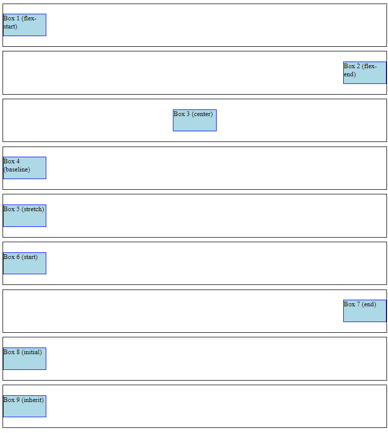

# Align Self Beispiele

Dies ist eine einfache HTML-Seite, die verschiedene Align-Self-Werte im Flexbox-Layout mit CSS zeigt.

## Vorschau

## Beschreibung

Diese HTML-Seite demonstriert verschiedene align-self-Werte, die auf Flex-Elemente innerhalb von Flex-Containern unter Verwendung des Flexbox-Layouts angewendet werden. Mit der Eigenschaft align-self können einzelne Flex-Elemente den für den Flex-Container festgelegten Wert align-items außer Kraft setzen. Im Folgenden werden die align-self-Werte zusammen mit ihrer Beschreibung vorgestellt:

- **flex-start**: Richtet das Flexelement am Anfang der Querachse aus.
- **flex-end**: Richtet das Flex-Element am Ende der Querachse aus.
- **Zentrum**: Zentriert das Flexelement entlang der Querachse.
- Grundlinie**: Richtet das Flexelement so aus, dass seine Grundlinie mit anderen Flexelementen übereinstimmt.
- Dehnen**: Dehnt das Flexelement so, dass es die Querachse ausfüllt.
- **Start**: Richtet das Flexelement am Anfang der Querachse aus, wobei der Wert align-items des Flexcontainers ignoriert wird.
- **Ende**: Richtet das Flexelement am Ende der Querachse aus, wobei der Wert align-items des Flexcontainers ignoriert wird.
- **initial**: Setzt den Wert align-self auf seinen Standardwert.
- **erben**: Erbt den Wert von align-self von seinem übergeordneten Element.

## Erste Schritte

Um die align-self Beispiele zu sehen, öffnen Sie einfach die Datei "index.html" in Ihrem Webbrowser.

## Abhängigkeiten

Dieses Projekt hat keine externen Abhängigkeiten. Es verwendet nur HTML und CSS, um die align-self-Beispiele zu erstellen.

Sie können diese align-self-Beispiele in Ihre Webanwendungen, Websites oder jedes andere Projekt integrieren, das align-self-Effekte benötigt.

Viel Spaß beim Experimentieren mit align-selfs und beim Verbessern Ihrer Designs mit diesen Beispielen!

## Erstellt mit

- HTML
- CSS
