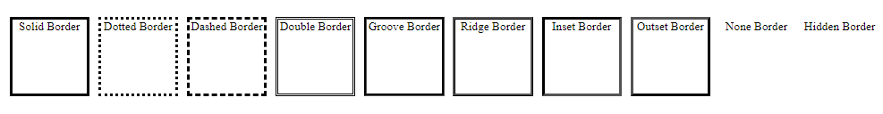

# Border Beispiele

Dies ist eine einfache HTML-Seite, die verschiedene Rahmenstile mit CSS zeigt.

## Vorschau

## Beschreibung

Diese HTML-Seite demonstriert verschiedene Rahmenstile, die auf div-Elemente angewendet werden. Auf jedes div-Element wird ein anderer Rahmenstil angewendet. Hier sind die vorgestellten Rahmenstile zusammen mit einer kurzen Beschreibung:

- **Einfarbige Umrandung**: Ein durchgehender Linienrahmen.
- **Gepunkteter Rahmen**: Ein Rahmen, der aus Punkten besteht.
- Gestrichelte Umrandung**: Ein Rahmen, der aus gestrichelten Linien besteht.
- **Doppelte Umrandung**: Eine Umrandung, die aus zwei parallelen Linien besteht.
- Gerillte Umrandung**: Ein gerillter 3D-Rahmeneffekt.
- Grat-Rahmen**: Ein 3D-Kamm-Rahmeneffekt.
- Eingelassene Umrandung**: Ein 3D-Einsatz-Rahmeneffekt.
- Abgesetzte Umrandung**: Ein 3D-Rahmeneffekt für den Außenbereich.
- **Kein Rand**: Kein Rahmen.
- Verdeckte Umrandung**: Ein verdeckter Rand, der Platz einnimmt, aber unsichtbar bleibt.

## Erste Schritte

Um die Rahmenbeispiele zu sehen, öffnen Sie einfach die Datei "index.html" in Ihrem Webbrowser.

## Abhängigkeiten

Dieses Projekt hat keine externen Abhängigkeiten. Es verwendet nur HTML und CSS, um die Rahmenbeispiele zu erstellen.

Sie können diese Rahmenbeispiele in Ihre Webanwendungen, Websites oder jedes andere Projekt, das Rahmeneffekte benötigt, integrieren.

Viel Spaß beim Experimentieren mit Rahmen und beim Aufwerten Ihrer Designs mit diesen Beispielen!

## Erstellt mit

- HTML
- CSS
