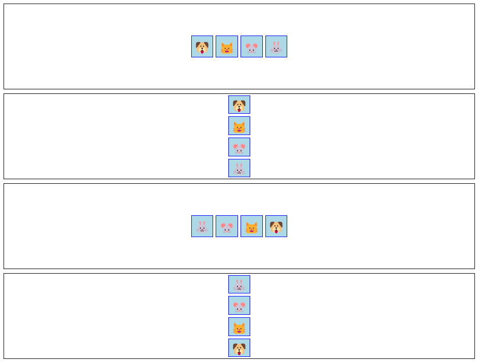

# Flex Direction Beispiele

Dieses Repository enthält HTML- und CSS-Beispiele, die verschiedene Flex-Direction-Werte in CSS demonstrieren und zeigen, wie sie das Layout und die Anordnung von Flex-Elementen beeinflussen.

## Beispiele

Die folgenden Flex-Direction-Beispiele sind in diesem Repository enthalten:

- **Row**: Die Flex-Elemente werden horizontal in einer Reihe angezeigt.
- **Spalte**: Die Flex-Elemente werden vertikal in einer Spalte angezeigt.
- **Row-Reverse**: Die Flex-Elemente werden horizontal in umgekehrter Reihenfolge angezeigt.
- **Spalten-Umgekehrt**: Die Flex-Elemente werden vertikal in umgekehrter Reihenfolge angezeigt.

## Vorschau

Hier ist eine Vorschau der Flex-Direction-Beispiele:

## Erste Schritte

Um die Beispiele anzusehen und mit ihnen zu arbeiten, können Sie die folgenden Schritte ausführen:

1. Klonen oder laden Sie dieses Repository auf Ihren lokalen Rechner herunter.
2. Öffnen Sie die Datei "index.html" in Ihrem bevorzugten Webbrowser.
3. Untersuchen Sie die verschiedenen Flex-Direction-Beispiele und beobachten Sie, wie die Flex-Elemente positioniert und ausgerichtet werden.

## Verwendung

Sie können diese Beispiele als Referenz oder Ausgangspunkt für Ihre eigenen Projekte verwenden. Sie können den HTML- und CSS-Code ändern, um mit verschiedenen Flex-Direction-Werten zu experimentieren und deren Auswirkungen auf das Layout zu beobachten.

Die HTML-Dateien definieren die Struktur der Flex-Container und ihrer untergeordneten Elemente. Die CSS-Dateien enthalten die Stile und Regeln, die die Flex-Richtung und andere verwandte Eigenschaften steuern.

## Abhängigkeiten

Für dieses Projekt gibt es keine externen Abhängigkeiten. Es verwendet nur HTML und CSS, um die Flex-Direction-Beispiele zu erstellen.

Sie können diese Flex-Direction-Beispiele in Ihre Webanwendungen, Websites oder jedes andere Projekt, das Flex-Direction-Effekte benötigt, integrieren.

Viel Spaß beim Experimentieren mit Flex-Directions und beim Verbessern Ihrer Designs mit diesen Beispielen!

## Gebaut mit

- HTML
- CSS
