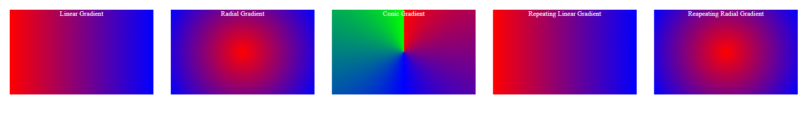

# Gradient

Dies ist eine einfache HTML- und CSS-Implementierung, die verschiedene Arten von Gradients demonstriert. Sie enthält Beispiele für lineare, radiale und konische Verläufe sowie für sich wiederholende lineare und radiale Verläufe.

## Vorschau

## Verwendung

Um diese Beispiele für Gradients in Ihrem HTML-Projekt zu verwenden, folgen Sie den nachstehenden Anweisungen:

1. Kopieren Sie den HTML-Code aus der mitgelieferten Datei `index.html` in Ihre eigene HTML-Datei.
2. Verknüpfen Sie die Datei `style.css` im head-Bereich Ihrer HTML-Datei mit dem folgenden Code:

   ``html
   <link rel="stylesheet" href="style.css">

Passen Sie die Gradient-Box-Elemente an Ihre Bedürfnisse an oder ändern Sie sie. Jedes Element hat eine bestimmte Klasse, die einem bestimmten Farbverlaufsstil entspricht.

## Farbverlaufstypen

Dieses Projekt enthält die folgenden Beispiele für Gradients:

- **Linearer Gradient**: Die Klasse linear-gradient erzeugt einen linearen Farbverlauf, der von links nach rechts von Rot (#ff0000) nach Blau (#0000ff) verläuft.
- **Radialer Farbverlauf**: Die Klasse radial-gradient erzeugt einen radialen Farbverlauf, der kreisförmig von Rot nach Blau verläuft.
- **Konischer Verlauf**: Mit der Klasse konischer Verlauf wird ein konischer Verlauf erstellt, der im Uhrzeigersinn von Rot über Blau zu Grün verläuft.
- **Wiederholender linearer Verlauf**: Die Klasse "Wiederholender linearer Farbverlauf" erstellt einen sich wiederholenden linearen Farbverlauf, der denselben Farbübergang von Rot nach Blau in einem kontinuierlichen Muster von links nach rechts wiederholt.
- **Wiederholender radialer Farbverlauf**: Die Klasse repeating-radial-gradient erstellt einen sich wiederholenden radialen Farbverlauf, der denselben Farbübergang von Rot nach Blau in einem kreisförmigen Muster wiederholt.

## Anpassung

Sie können die Farben und Stile des Farbverlaufs an Ihre Designvorlieben anpassen. Sie können den HTML- und CSS-Code entsprechend ändern.

Die Klasse gradient-box legt die Breite, Höhe, den Rand, die Textausrichtung und die Textfarbe für die Farbverlaufsboxen fest. Passen Sie diese Eigenschaften an Ihr gewünschtes Layout an.

## Abhängigkeiten

Dieses Projekt hat keine externen Abhängigkeiten. Es verwendet nur HTML und CSS, um die Beispiele für Gradients zu erstellen.

Sie können diese Beispiele für Gradients in Ihre Webanwendungen, Websites oder andere Projekte, die Gradients benötigen, integrieren.

Viel Spaß beim Experimentieren mit Gradients und beim Aufwerten Ihrer Designs mit diesen Beispielen!

## Erstellt mit

- HTML
- CSS
