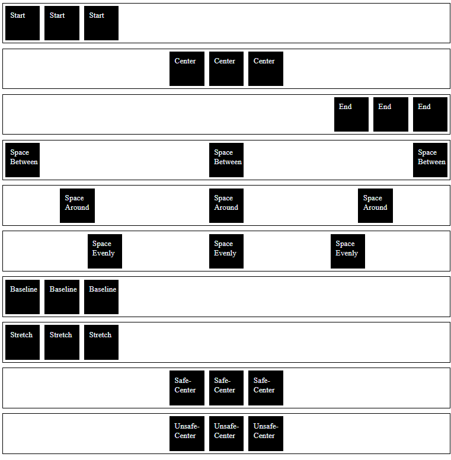

# Justify-Content-Beispiele

Dies ist eine einfache HTML-Seite, die verschiedene justify-content-Werte im Flexbox-Layout mit CSS zeigt.

## Vorschau

## Beschreibung

Diese HTML-Seite demonstriert verschiedene justify-content-Werte, die auf Flex-Container im Flexbox-Layout angewendet werden. Die Eigenschaft justify-content steuert, wie Flex-Elemente entlang der Hauptachse positioniert werden. Im Folgenden werden die justify-content-Werte zusammen mit ihren Beschreibungen vorgestellt:

- **Start**: Richtet Flex-Elemente am Anfang des Containers aus.
- **Center**: Zentriert die Flex-Elemente entlang der Hauptachse.
- **End**: Richtet die Flexelemente am Ende des Containers aus.
- **Abstand zwischen**: Verteilt die flexiblen Elemente gleichmäßig mit einem Abstand zwischen ihnen.
- **Raum um**: Verteilt die flexiblen Elemente gleichmäßig mit Platz um sie herum.
- **Gleichmäßiger Abstand**: Verteilt die flexiblen Elemente gleichmäßig mit gleichem Abstand um sie herum.
- **Basislinie**: Richtet Flexelemente so aus, dass ihre Grundlinien übereinstimmen.
- **Dehnen**: Dehnt Flexelemente so, dass sie den Container entlang der Hauptachse ausfüllen.
- **Sicher zentrieren**: Zentriert die Flexelemente sicher innerhalb des Containers, um ein Überlaufen zu vermeiden.
- Unsicheres Zentrieren**: Zentriert Flex-Elemente innerhalb des Containers, was zu einem Überlauf führen kann.

## Erste Schritte

Um die justify-content-Beispiele zu sehen, öffnen Sie einfach die Datei "index.html" in Ihrem Webbrowser.

## Abhängigkeiten

Dieses Projekt hat keine externen Abhängigkeiten. Es verwendet nur HTML und CSS, um die justify-content-Beispiele zu erstellen.

Sie können diese justify-content-Beispiele in Ihre Webanwendungen, Websites oder jedes andere Projekt integrieren, das justify-content-Effekte benötigt.

Viel Spaß beim Experimentieren mit justify-content und beim Aufwerten Ihrer Designs mit diesen Beispielen!

## Gebaut mit

- HTML
- CSS
