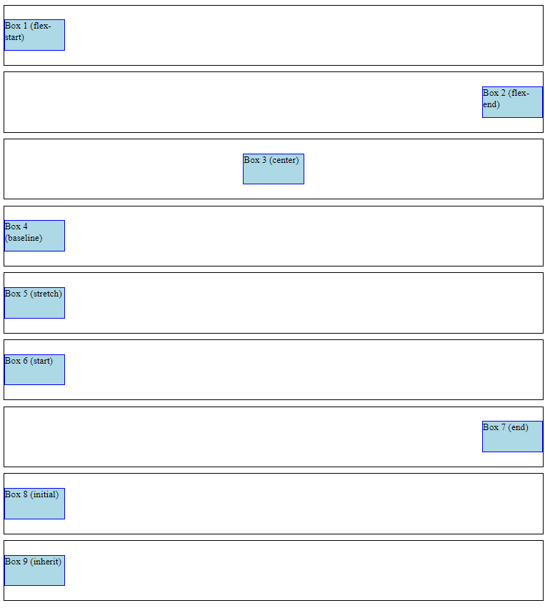

# Align Self Examples

This is a simple HTML page showcasing different align-self values in flexbox layout using CSS.

## Preview

## Description

This HTML page demonstrates various align-self values applied to flex items within flex containers using the flexbox layout. The align-self property allows individual flex items to override the align-items value set on the flex container. Here are the align-self values showcased along with their descriptions:

- **flex-start**: Aligns the flex item at the start of the cross axis.
- **flex-end**: Aligns the flex item at the end of the cross axis.
- **center**: Centers the flex item along the cross axis.
- **baseline**: Aligns the flex item such that its baseline aligns with other flex items.
- **stretch**: Stretches the flex item to fill the cross axis.
- **start**: Aligns the flex item at the start of the cross axis, ignoring the flex container's align-items value.
- **end**: Aligns the flex item at the end of the cross axis, ignoring the flex container's align-items value.
- **initial**: Sets the align-self value to its default value.
- **inherit**: Inherits the align-self value from its parent element.

## Getting Started

To view the align-self examples, simply open the `index.html` file in your web browser.

## Dependencies

This project does not have any external dependencies. It only uses HTML and CSS to create the align-self examples.

You can integrate these align-self examples into your web applications, websites, or any project that requires align-self effects.

Enjoy experimenting with align-selfs and enhancing your designs with these examples!

## Built With

- HTML
- CSS
