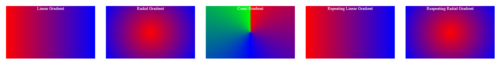

# Gradient

This is a simple HTML and CSS implementation that demonstrates different types of gradients. It includes examples of linear, radial, and conic gradients, as well as repeating linear and radial gradients.

## Preview



## Usage

To use these gradient examples in your HTML project, follow the instructions below:

1. Copy the HTML code from the provided `index.html` file into your own HTML file.
2. Link the `style.css` file in the head section of your HTML file using the following code:

   ```html
   <link rel="stylesheet" href="style.css">

Customize or modify the gradient-box elements to suit your needs. Each element has a specific class that corresponds to a particular gradient style.

## Gradient Types

This project includes the following gradient examples:

- **Linear Gradient**: The linear-gradient class creates a linear gradient that transitions from red (#ff0000) to blue (#0000ff) from left to right.
- **Radial Gradient**: The radial-gradient class creates a radial gradient that transitions from red to blue in a circular pattern.
- **Conic Gradient**: The conic-gradient class creates a conic gradient that transitions from red to blue to green in a clockwise direction.
- **Repeating Linear Gradient**: The repeating-linear-gradient class creates a repeating linear gradient that repeats the same color transition from red to blue in a continuous pattern from left to right.
- **Repeating Radial Gradient**: The repeating-radial-gradient class creates a repeating radial gradient that repeats the same color transition from red to blue in a circular pattern.

## Customization

Feel free to customize the gradient colors and styles to match your design preferences. You can modify the HTML and CSS code accordingly.

The gradient-box class sets the width, height, margin, text alignment, and text color for the gradient boxes. Adjust these properties to fit your desired layout.

## Dependencies

This project does not have any external dependencies. It only uses HTML and CSS to create the gradient examples.

You can integrate these gradient examples into your web applications, websites, or any project that requires gradient effects.

Enjoy experimenting with gradients and enhancing your designs with these examples!

## Built With

- HTML
- CSS
