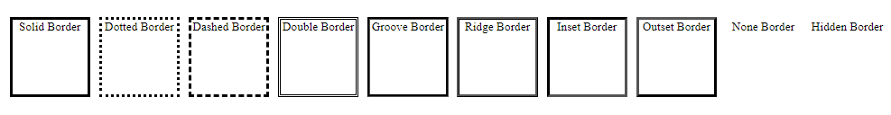

# Border Examples

This is a simple HTML page showcasing different border styles using CSS.

## Preview

## Description

This HTML page demonstrates various border styles applied to div elements. Each div has a different border style applied to it. Here are the border styles showcased along with a brief description:

- **Solid Border**: A solid line border.
- **Dotted Border**: A border consisting of dots.
- **Dashed Border**: A border consisting of dashed lines.
- **Double Border**: A border consisting of two parallel lines.
- **Groove Border**: A 3D grooved border effect.
- **Ridge Border**: A 3D ridge border effect.
- **Inset Border**: A 3D inset border effect.
- **Outset Border**: A 3D outset border effect.
- **None Border**: No border.
- **Hidden Border**: A hidden border that takes up space but remains invisible.

## Getting Started

To view the border examples, simply open the `index.html` file in your web browser.

## Dependencies

This project does not have any external dependencies. It only uses HTML and CSS to create the border examples.

You can integrate these border examples into your web applications, websites, or any project that requires border effects.

Enjoy experimenting with borders and enhancing your designs with these examples!

## Built With

- HTML
- CSS
