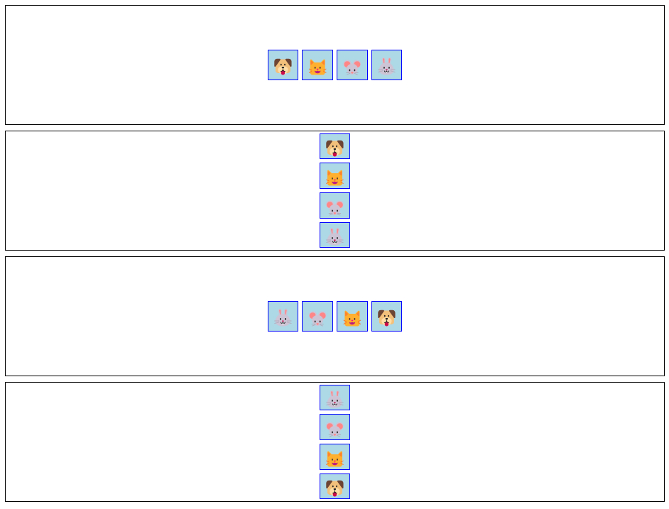

# Flex Direction Examples

This repository contains HTML and CSS examples that demonstrate different flex-direction values in CSS, showcasing how they affect the layout and arrangement of flex items.

## Examples

The following flex-direction examples are included in this repository:

- **Row**: The flex items are displayed horizontally in a row.
- **Column**: The flex items are displayed vertically in a column.
- **Row-Reverse**: The flex items are displayed horizontally in reverse order.
- **Column-Reverse**: The flex items are displayed vertically in reverse order.

## Preview

Here is a preview of the flex-direction examples:

## Getting Started

To view and interact with the examples, you can follow these steps:

1. Clone or download this repository to your local machine.
2. Open the `index.html` file in your preferred web browser.
3. Explore the different flex-direction examples and observe how the flex items are positioned and aligned.

## Usage

Feel free to use these examples as a reference or starting point for your own projects. You can modify the HTML and CSS code to experiment with different flex-direction values and see their impact on the layout.

The HTML files define the structure of the flex containers and their child elements. The CSS files contain the styles and rules that control the flex-direction and other related properties.

## Dependencies

This project does not have any external dependencies. It only uses HTML and CSS to create the flex-direction examples.

You can integrate these flex-direction examples into your web applications, websites, or any project that requires flex-direction effects.

Enjoy experimenting with flex-directions and enhancing your designs with these examples!

## Built With

- HTML
- CSS
