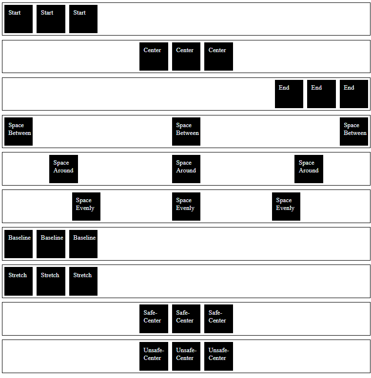

# Justify Content Examples

This is a simple HTML page showcasing different justify-content values in flexbox layout using CSS.

## Preview

## Description

This HTML page demonstrates various justify-content values applied to flex containers using the flexbox layout. The justify-content property controls how flex items are positioned along the main axis. Here are the justify-content values showcased along with their descriptions:

- **Start**: Aligns flex items at the start of the container.
- **Center**: Centers flex items along the main axis.
- **End**: Aligns flex items at the end of the container.
- **Space Between**: Distributes flex items evenly with space between them.
- **Space Around**: Distributes flex items evenly with space around them.
- **Space Evenly**: Distributes flex items evenly with equal space around them.
- **Baseline**: Aligns flex items such that their baselines align.
- **Stretch**: Stretch flex items to fill the container along the main axis.
- **Safe-Center**: Centers flex items safely within the container, avoiding overflow.
- **Unsafe-Center**: Centers flex items within the container, potentially causing overflow.

## Getting Started

To view the justify-content examples, simply open the `index.html` file in your web browser.

## Dependencies

This project does not have any external dependencies. It only uses HTML and CSS to create the justify-content examples.

You can integrate these justify-content examples into your web applications, websites, or any project that requires justify-content effects.

Enjoy experimenting with justify-contents and enhancing your designs with these examples!

## Built With

- HTML
- CSS
